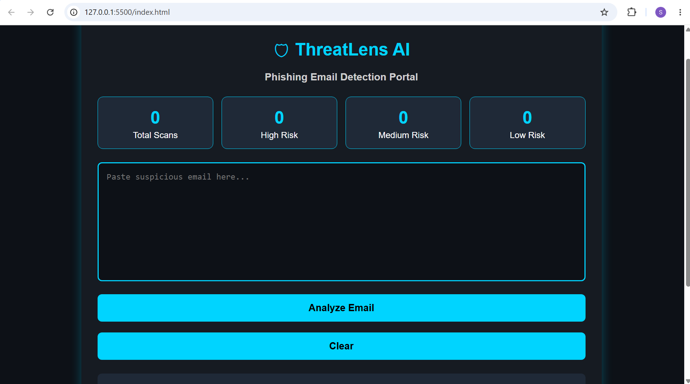
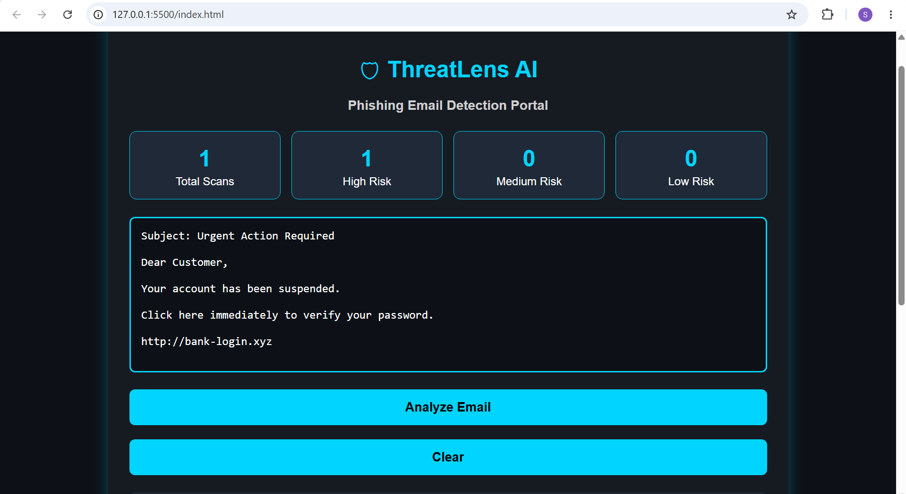

# 🛡 ThreatLens AI – Intelligent Phishing Email Detection Portal

ThreatLens AI is a cybersecurity-focused web application that helps users identify phishing emails by analyzing suspicious keywords and malicious links. The application calculates a dynamic risk score, classifies emails into **Low**, **Medium**, or **High Risk**, and provides actionable security recommendations through an interactive dashboard.

Designed as a proof-of-concept cybersecurity solution, this project demonstrates secure web application concepts, risk assessment techniques, and responsive user interface development.

---

## 🚀 Features

- 📧 Analyze suspicious email content
- 🔍 Detect phishing-related keywords
- 🔗 Identify suspicious URLs and malicious links
- 📊 Calculate dynamic risk scores
- 🟢 Low, 🟡 Medium, and 🔴 High Risk classification
- 📈 Interactive dashboard with live scan counters
- 💡 Security recommendations based on risk level
- 🧹 Clear email input functionality
- 🎨 Responsive and modern cybersecurity-themed interface

---

## 🖥️ Application Preview

### 🏠 Home Page

> Add your homepage screenshot here



### 🔍 Phishing Detection Result

> Add your result screenshot here



---

## 🛠️ Technology Stack

| Category | Technology |
|----------|------------|
| Frontend | HTML5, CSS3, JavaScript |
| UI Design | Responsive Web Design |
| Domain | Cybersecurity |

---

## 📂 Project Structure

```text
ThreatLensAI
│
├── index.html
├── style.css
├── script.js
├── README.md
└── images
    ├── homepage.png
    └── result.png
```

---

## ⚙️ How It Works

1. Paste the email content into the input box.
2. Click **Analyze Email**.
3. The application:
   - Scans for phishing keywords
   - Detects suspicious URLs
   - Calculates a risk score
   - Classifies the email as Low, Medium, or High Risk
   - Displays security recommendations
4. Dashboard counters update automatically after each scan.

---

## 📌 Current Features

- ✔ Phishing Keyword Detection
- ✔ Suspicious Link Detection
- ✔ Dynamic Risk Scoring
- ✔ Interactive Dashboard
- ✔ Live Scan Counter
- ✔ Security Recommendation System
- ✔ Modern Cybersecurity User Interface

---

## 🚀 Future Enhancements

- ☕ Java Spring Boot Backend
- 🗄️ MySQL Database Integration
- 🔐 User Authentication & Authorization
- 🌐 REST API Development
- 🤖 AI-Based Phishing Detection
- 📄 PDF Report Generation
- 📊 Data Visualization Dashboard
- ☁️ Cloud Deployment
- 🔗 Salesforce CRM Integration
- 📧 Email Header & Attachment Analysis

---

## 💼 Skills Demonstrated

- Cybersecurity Fundamentals
- Secure Web Application Development
- Risk Assessment & Analysis
- Dashboard Design
- Responsive Web Development
- Client-Side Validation
- Problem Solving
- JavaScript DOM Manipulation

---

## 🎯 Enterprise Relevance

This project is designed with enterprise application concepts in mind and aligns with skills commonly required in software development and cybersecurity roles, including:

- Java *(Future Enhancement)*
- MySQL *(Future Enhancement)*
- REST APIs *(Future Enhancement)*
- Cybersecurity
- Secure Coding Practices
- Dashboard Development
- Web Application Development
- Salesforce Integration *(Future Enhancement)*

---

## 👩‍💻 Developer

**Suhani Guralwar**

Computer Engineering Student | Web Development | Cybersecurity Enthusiast

---

## 📜 License

This project is licensed under the **MIT License**.

---

⭐ If you found this project useful, consider giving it a **Star** on GitHub!